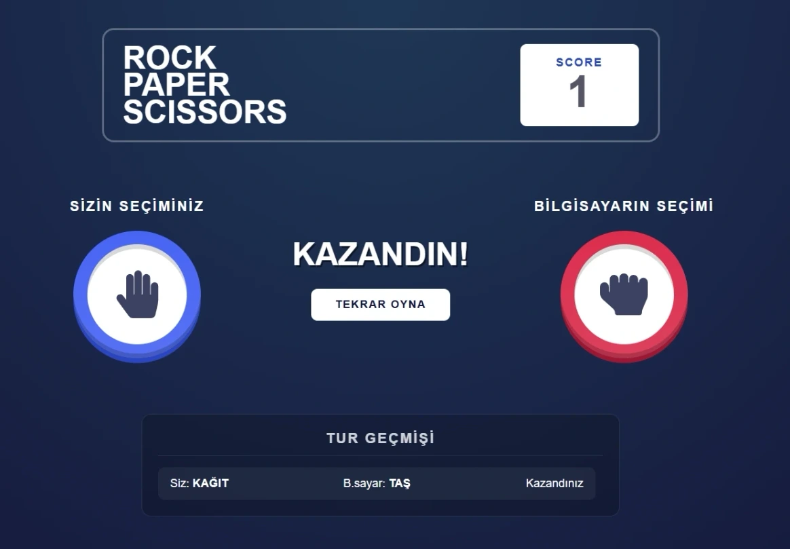

# rock-paper-scissors-game

React • Vite • SCSS • React Icons App

---

[See The Project](https://akrockpaperscissorsgame.netlify.app/)

---



---

Bu proje, **Patika.dev** Front-End Eğitim Programı gereksinimlerine uygun olarak geliştirilmiş; modern SCSS mimarisi, performanslı React state yönetimi ve responsive tasarım prensiplerini bir araya getiren dinamik bir Taş-Kağıt-Makas uygulamasıdır. Kullanıcıya karşı bilgisayarın hamle yaptığı, skor ve maç sonu takibi yapan profesyonel bir portföy çalışmasıdır.

### 🚀 Özellikler

- **Dinamik Oyun Akışı:** Kullanıcı seçimini yaptıktan sonra bilgisayarın rastgele hamlesiyle (`Math.random`) karşılaştırılan ve anlık sonuç üreten oyun motoru.
- **Gelişmiş Skor Sistemi:** Kazanılan turlarda +1, kaybedilen turlarda -1 puan eklenir. Beraberlik durumunda skor korunur.
- **Maç Sonu Kontrolü:** Skor tabelasında **3** rakamı göründüğünde kullanıcı, **-3** göründüğünde ise bilgisayar maçı kazanmış sayılır ve özel bir "Maç Bitti" modalı ile sonuç ilan edilir.
- **Kapsamlı Tur Geçmişi:** Oynanan her turun detayını (Oyuncu seçimi, Bilgisayar seçimi ve Sonuç) listeleyen, `max-height` ve özel tasarlanmış scrollbar ile taşma korumalı geçmiş alanı.
- **Modern SCSS Mimarisi:** Dart Sass standartlarına uygun `@use` yapısı, değişken (variable) yönetimi ve iç içe (nesting) yazım ile temiz ve sürdürülebilir stil dosyaları.
- **Performans Optimizasyonu:** Maç kazananı kontrolü için `useEffect` yerine "Derived State" (Türetilmiş Durum) yapısı kullanılarak gereksiz render'lar engellenmiş ve performans artırılmıştır.
- **Tam Responsive Tasarım:** Header ve oyun alanı bileşenleri, mobil cihazlardan geniş ekranlı monitörlere kadar kusursuz bir deneyim sunacak şekilde tasarlanmıştır.

### 🛠️ Teknoloji Yığını

- **Frontend:** React (Vite)
- **Styling:** SCSS (Modern & Responsive UI)
- **İkonlar:** React Icons (FontAwesome & IoIcons)
- **Durum Yönetimi:** React Hooks (`useState`, `Derived State`)
- **Paket Yöneticisi:** Yarn

### 📋 Gereksinimler

- Node.js (v18+)
- Yarn (v1.22+)

### 🔧 Kurulum ve Çalıştırma

```bash
# Projeyi klonlayın
git clone https://github.com/alperenkursun/rock-paper-scissors-game

# Proje klasörüne gidin
cd rock-paper-scissors-game

# Gerekli paketleri yükleyin
yarn install

# Uygulamayı başlatın (Development Server)
yarn dev
```

---

[Frontend Web Development Projeleri](https://academy.patika.dev/courses/frontend-web-development-projeleri/tas-kagit-makas)

[Patika Profile](https://academy.patika.dev/tr/@alpk)